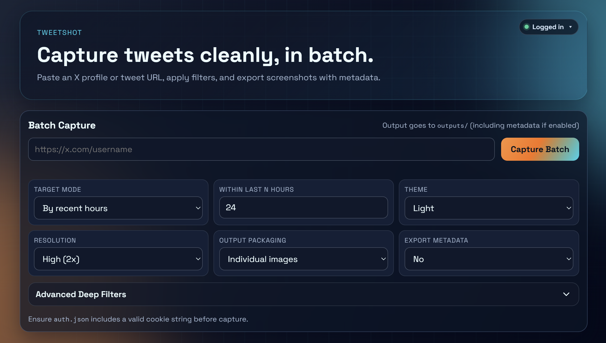

# Tweetshot

<div align="center">


</div>

Tweetshot is a robust tool for capturing X (Twitter) posts in batch as clean, high-quality screenshots. It supports advanced filtering, metadata export, and automatic packaging.



## Key Features

- **Batch Capture**: Rapidly scan and capture profile timelines.
- **Flexible Target Modes**: 
  - **Count**: Specify exactly how many tweets to capture.
  - **Date**: Pull everything since a specific UTC date.
  - **Hours**: Capture posts from the last N hours.
- **Deep Filters**: Filter by post type (Original, Retweet, Reply, Quote), media content (Text, Image, Video), or presence of external links.
- **Pro Output**:
  - **High Resolution**: Configurable scale factor (up to 3x).
  - **Theming**: Support for Dark and Light modes.
  - **Packaging**: Output as individual images or a single ZIP archive.
  - **Metadata**: Export tweet data directly to `outputs/` as `.json` files.
- **Two Ways to Use**: Modern FastAPI-based Web UI or a powerful CLI.


## Project Structure

```text
.
├── app.py                # FastAPI server + REST API
├── screenshot.py         # Core capture engine + CLI commands
├── auth.py               # Interactive auth helper
├── static/               # Web UI (HTML/CSS/JS)
├── outputs/              # (Auto-created) Captured screenshots & metadata
└── auth.json             # (Auto-created) Login session storage
```

## Getting Started

### Prerequisites
- Python 3.10+
- [Conda](https://docs.conda.io/en/latest/) (Recommended)

### Installation

> [!IMPORTANT]
> Always ensure your environment is active before running scripts.

```bash
# Activate your environment first
conda activate your_env_name

# Install dependencies
pip install -r requirements.txt
playwright install chromium
```

### Launch Web UI

```bash
python app.py
```
*Alternatively: `uvicorn app:app --host 127.0.0.1 --port 8000 --reload`*

Open **[http://localhost:8000](http://localhost:8000)** in your browser.

## Authentication

X capture quality and reliability depend on valid login cookies (`auth_token`, `ct0`).

- **Web UI**: Open the **Auth Status** bar in the header and paste your `Cookie:` header.
- **CLI**: Run `python auth.py` and follow the interactive prompts.
- **Check Status**: `python screenshot.py auth-status`

## CLI Usage (`screenshot.py`)

### Basic Batch
```bash
python screenshot.py batch "https://x.com/username" --count 10
```

### Advanced Filtering
```bash
python screenshot.py batch "https://x.com/username" \
  --since-hours 24 \
  --types original,reply \
  --media image \
  --export-json \
  --zip-output
```

### Headed Mode (for debugging)
```bash
python screenshot.py batch "https://x.com/username" --count 5 --headed
```
